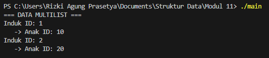
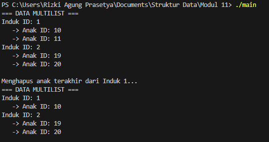

## 1. Nama, NIM, Kelas

- **Nama**: Rizki Agung Prasetya

- **NIM**: 103112400263

- **Kelas**: IF 12-05

  

## 2. Motivasi Belajar Struktur Data

Belajar struktur data itu bukan cuma soal bisa bikin kode jalan, tapi tentang bagaimana kita membangun pola pikir yang teratur. Ibarat kita menata buku di perpustakaan, kalau asal taruh pasti bikin pusing saat mencari. Tapi dengan sistem penyimpanan yang jelas, semua jadi mudah ditemukan. Sama halnya dengan struktur data semakin kita paham cara menyusun dan mengelola data, semakin efisien program yang kita buat. Selain bermanfaat di dunia pemrograman, cara berpikir logis dan efisien ini juga terbawa ke kehidupan sehari-hari. Jadi meskipun awalnya terasa berat, anggap saja setiap konsep struktur data adalah fondasi kuat yang akan mempermudah kita menghadapi tantangan teknologi di masa depan.

  

## 3. Dasar Teori

Struktur data adalah cara komputer menyimpan dan mengatur data agar dapat diproses dengan efisien. Pada praktikum ini digunakan dua struktur data lanjutan, yaitu Multi Linked List dan Circular Linked List.

Multi Linked List digunakan untuk merepresentasikan hubungan hierarkis. Pada studi kasus Pegawai, setiap node induk dapat memiliki daftar node anak. Struktur ini dibangun menggunakan Doubly Linked List sehingga dapat ditelusuri dua arah. Jika node induk dihapus, seluruh node anak yang terhubung juga ikut terhapus.

Circular Linked List adalah linked list di mana node terakhir menunjuk kembali ke node pertama sehingga membentuk lingkaran. Pada studi kasus Mahasiswa, struktur ini memudahkan traversal berulang karena list tidak memiliki ujung; penelusuran berhenti ketika pointer kembali ke node awal. Struktur ini cocok untuk data yang diputar terus-menerus tanpa reset manual.
  

## 4. Guided

### 4.1 Guided 1
```c++

#ifndef MULTILIST_H_INCLUDED
#define MULTILIST_H_INCLUDED
#include <iostream>
#define Nil NULL

using namespace std;

typedef int infotype;
typedef struct elemen_induk *address_induk;
typedef struct elemen_anak *address_anak;

struct elemen_anak {
    infotype info;
    address_anak next;
    address_anak prev;
};

struct list_anak {
    address_anak first;
    address_anak last;
};

struct elemen_induk {
    infotype info;
    list_anak anak;
    address_induk next;
    address_induk prev;
};

struct list_induk {
    address_induk first;
    address_induk last;
};

void createList(list_induk &L);
address_induk alokasi(infotype x);
void insertFirstInduk(list_induk &L, address_induk P);
void insertLastInduk(list_induk &L, address_induk P);
void insertAfterInduk(list_induk &L, address_induk Prec, address_induk P);
void deleteFirstInduk(list_induk &L, address_induk &P);
void deleteLastInduk(list_induk &L, address_induk &P);
void deleteAfterInduk(list_induk &L, address_induk Prec, address_induk &P);
address_induk findInduk(list_induk L, infotype x);

address_anak alokasiAnak(infotype x);
void insertFirstAnak(list_anak &LA, address_anak PA);
void insertLastAnak(list_anak &LA, address_anak PA);
void insertAfterAnak(list_anak &LA, address_anak Prec, address_anak PA);
void deleteFirstAnak(list_anak &LA, address_anak &PA);
void deleteLastAnak(list_anak &LA, address_anak &PA);
void deleteAfterAnak(list_anak &LA, address_anak Prec, address_anak &PA);
address_anak findAnak(list_anak LA, infotype x);

void printInfo(list_induk L);

#endif

```

**Penjelasan :** File multilist.h berfungsi sebagai antarmuka utama yang menentukan struktur dasar dari Multi Linked List. File ini dimulai dengan header guard serta tipe data yang memastikan konsistensi penamaan. Bagian utamanya mencakup empat struct, yaitu elemen_anak dan list_anak sebagai sub-list, serta elemen_induk yang memiliki field bertipe list_anak, sehingga setiap node induk langsung membawa list anaknya sendiri. Semua komponen tersebut dikelola melalui list_induk dan dilengkapi dengan deklarasi fungsi-fungsi ADT untuk pengelolaan memori, pembuatan list, serta operasi manipulasi data seperti insert, delete, dan search. Dengan demikian, hubungan data Induk–Anak dapat diatur secara modular namun tetap saling terhubung dalam satu sistem.


### 4.2 Guided 2
```c++

#include "multilist.h"

void createList(list_induk &L) {
    L.first = Nil;
    L.last = Nil;
}

address_induk alokasi(infotype x) {
    address_induk P = new elemen_induk;
    P->info = x;
    P->next = Nil;
    P->prev = Nil;
    P->anak.first = Nil;
    P->anak.last = Nil;
    return P;
}

void insertLastInduk(list_induk &L, address_induk P) {
    if (L.first == Nil) {
        L.first = P;
        L.last = P;
    } else {
        P->prev = L.last;
        L.last->next = P;
        L.last = P;
    }
}

void insertFirstInduk(list_induk &L, address_induk P) {
    if (L.first == Nil) {
        L.first = P;
        L.last = P;
    } else {
        P->next = L.first;
        L.first->prev = P;
        L.first = P;
    }
}

void insertAfterInduk(list_induk &L, address_induk Prec, address_induk P) {
    if (Prec != Nil) {
        P->next = Prec->next;
        P->prev = Prec;
        if (Prec->next != Nil) {
            Prec->next->prev = P;
        } else {
            L.last = P;
        }
        Prec->next = P;
    }
}

void deleteFirstInduk(list_induk &L, address_induk &P) {
    if (L.first != Nil) {
        P = L.first;
        if (L.first == L.last) {
            L.first = Nil;
            L.last = Nil;
        } else {
            L.first = L.first->next;
            L.first->prev = Nil;
            P->next = Nil;
        }
    }
}

void deleteLastInduk(list_induk &L, address_induk &P) {
    if (L.first != Nil) {
        P = L.last;
        if (L.first == L.last) {
            L.first = Nil;
            L.last = Nil;
        } else {
            L.last = L.last->prev;
            L.last->next = Nil;
            P->prev = Nil;
        }
    }
}

address_induk findInduk(list_induk L, infotype x) {
    address_induk P = L.first;
    while (P != Nil) {
        if (P->info == x) return P;
        P = P->next;
    }
    return Nil;
}

void printInfo(list_induk L) {
    address_induk PI = L.first;
    cout << "=== DATA MULTILIST ===" << endl;
    while (PI != Nil) {
        cout << "Induk ID: " << PI->info << endl;
        address_anak PA = PI->anak.first;
        if (PA == Nil) {
            cout << "   (Tidak ada anak)" << endl;
        } else {
            while (PA != Nil) {
                cout << "   -> Anak ID: " << PA->info << endl;
                PA = PA->next;
            }
        }
        PI = PI->next;
    }
    cout << endl;
}


```

**Penjelasan** : File multilist.cpp berisi implementasi utama yang menjalankan seluruh proses pengelolaan List Induk pada struktur Multi Linked List. Di dalamnya terdapat penerapan nyata dari fungsi-fungsi dasar, mulai dari fungsi alokasi yang bertugas membuat node induk baru serta menyiapkan pointer menuju list anak (diinisialisasi ke NULL). File ini juga mengatur semua operasi manipulasi data pada level induk menggunakan mekanisme Doubly Linked List, termasuk pengaturan pointer next dan prev pada proses penyisipan dan penghapusan. Selain itu, fungsi printInfo menggunakan pola perulangan bersarang untuk menelusuri setiap elemen induk dan kemudian memanggil list anaknya, sehingga keseluruhan struktur hierarki dapat ditampilkan dengan rapi dan lengkap.


### 4.3 Guided 3
```c++
#include "multilist.h"

address_anak alokasiAnak(infotype x) {
    address_anak P = new elemen_anak;
    P->info = x;
    P->next = Nil;
    P->prev = Nil;
    return P;
}

void insertFirstAnak(list_anak &LA, address_anak PA) {
    if (LA.first == Nil) {
        LA.first = PA;
        LA.last = PA;
    } else {
        PA->next = LA.first;
        LA.first->prev = PA;
        LA.first = PA;
    }
}

void insertLastAnak(list_anak &LA, address_anak PA) {
    if (LA.first == Nil) {
        insertFirstAnak(LA, PA);
    } else {
        PA->prev = LA.last;
        LA.last->next = PA;
        LA.last = PA;
    }
}

void deleteFirstAnak(list_anak &LA, address_anak &PA) {
    if (LA.first != Nil) {
        PA = LA.first;
        if (LA.first == LA.last) {
            LA.first = Nil;
            LA.last = Nil;
        } else {
            LA.first = LA.first->next;
            LA.first->prev = Nil;
            PA->next = Nil;
        }
    }
}

void deleteLastAnak(list_anak &LA, address_anak &PA) {
    if (LA.first != Nil) {
        PA = LA.last;
        if (LA.first == LA.last) {
            LA.first = Nil;
            LA.last = Nil;
        } else {
            LA.last = LA.last->prev;
            LA.last->next = Nil;
            PA->prev = Nil;
        }
    }
}


```

**Penjelasan** : File multilist_anak.cpp berfungsi sebagai modul khusus yang menangani seluruh operasi pada bagian sub-list atau List Anak, sehingga logika pengelolaan data anak terpisah dari proses List Induk dan kode menjadi lebih rapi. Di dalam file ini terdapat implementasi fungsi alokasiAnak untuk membuat node anak baru, serta berbagai prosedur manipulasi data seperti penambahan dan penghapusan elemen di bagian awal maupun akhir list. Semua proses tersebut berjalan dengan prinsip Doubly Linked List, memanfaatkan pointer next dan prev agar setiap node anak dapat saling terhubung dengan baik. Dengan demikian, manajemen data pada level anak dapat dilakukan secara mandiri sebelum akhirnya dikaitkan dengan node induk yang sesuai.

### 4.4 Guided 4
```c++
#include "multilist.h"
#include <iostream>
using namespace std;

int main() {
    list_induk L;
    createList(L);

    address_induk P1 = alokasi(1);
    insertLastInduk(L, P1);

    address_anak PA1 = alokasiAnak(10);
    insertLastAnak(P1->anak, PA1);

    address_induk P2 = alokasi(2);
    insertLastInduk(L, P2);

    address_anak PA2 = alokasiAnak(20);
    insertLastAnak(P2->anak, PA2);

    printInfo(L);
    return 0;
}

```

**Penjelasan** : File main.cpp berfungsi sebagai driver yang menguji keseluruhan struktur Multi Linked List yang telah dibuat. Di dalamnya, list induk terlebih dahulu diinisialisasi, lalu beberapa node induk dan node anak dialokasikan sebagai contoh data. Bagian terpenting dari file ini adalah proses pembentukan hubungan hierarkis, di mana setiap node anak dimasukkan ke dalam list anak milik induk tertentu (misalnya melalui P1->anak). Hal ini menunjukkan bahwa setiap induk dapat memiliki sub-list anak yang berbeda secara mandiri. Pada akhir program, seluruh data ditampilkan ke layar untuk memastikan bahwa relasi antara induk dan anak telah bekerja sesuai tujuan.


**Output** 

 

  
## 5. Unguided

### 5.1 Unguided 1
```c++

#include "multilist.h"
#include <iostream>
using namespace std;

int main() {
    list_induk L;
    createList(L);

    address_induk P1 = alokasi(1);
    insertLastInduk(L, P1);
    
    address_induk P2 = alokasi(2);
    insertLastInduk(L, P2);

    insertLastAnak(P1->anak, alokasiAnak(10));
    insertLastAnak(P1->anak, alokasiAnak(11));
    
    insertLastAnak(P2->anak, alokasiAnak(20));
    insertFirstAnak(P2->anak, alokasiAnak(19));


    printInfo(L);

    cout << "Menghapus anak terakhir dari Induk 1..." << endl;
    address_anak PDel;
    deleteLastAnak(P1->anak, PDel);
    
    printInfo(L);

    return 0;
}

```


**Penjelasan :**  Kode ini merupakan program utama untuk menguji ADT Multilist, yang terdiri dari list induk dan masing-masing memiliki list anak. Program diawali dengan membuat objek list_induk dan menginisialisasinya menggunakan createList. Dua elemen induk kemudian dibuat dengan nilai 1 dan 2, lalu ditambahkan ke bagian belakang list melalui insertLastInduk.

Untuk induk pertama, dua anak bernilai 10 dan 11 ditambahkan ke bagian akhir list anak menggunakan insertLastAnak. Pada induk kedua, ditambahkan dua anak juga: nilai 20 disisipkan di belakang, sementara nilai 19 ditempatkan di bagian depan menggunakan insertFirstAnak, sehingga menjadi elemen pertama list anak induk tersebut.

Setelah struktur multilist terbentuk, fungsi printInfo digunakan untuk menampilkan seluruh relasi induk–anak. Program kemudian melakukan operasi penghapusan, yaitu menghapus elemen anak terakhir dari induk pertama melalui deleteLastAnak, dan node yang dihapus disimpan dalam variabel PDel. Struktur list kembali ditampilkan untuk memperlihatkan perubahan.

Secara keseluruhan, kode ini menunjukkan proses pembuatan multilist, penambahan induk dan anak, serta penghapusan elemen anak menggunakan operasi dasar pada double linked list.


**Output** 

 


 ### 5.2 Unguided 2

 **circularlist.h**
```c++

#ifndef CIRCULARLIST_H_INCLUDED
#define CIRCULARLIST_H_INCLUDED

#include <string>
using namespace std;

typedef struct mahasiswa {
    string nama;
    string nim;
    char jenis_kelamin;
    float ipk;
} infotype;

typedef struct ElmList *address;

struct ElmList {
    infotype info;
    address next;
};

struct List {
    address First; 
};

void CreateList(List &L);
address alokasi(infotype x);
void dealokasi(address &P);

void insertFirst(List &L, address P);
void insertAfter(List &L, address Prec, address P);
void insertLast(List &L, address P);

void deleteFirst(List &L, address &P);
void deleteAfter(List &L, address Prec, address &P);
void deleteLast(List &L, address &P);

address findElm(List L, infotype x); 
void printInfo(List L);

#endif
```

**Penjelasan :**Kode ini merupakan header file untuk membangun ADT Circular Linked List yang menyimpan data mahasiswa. Informasi mahasiswa (nama, NIM, jenis kelamin, dan IPK) ditempatkan dalam struktur infotype. Setiap node direpresentasikan oleh ElmList, yang berisi data mahasiswa dan pointer next. Karena bersifat circular, node terakhir selalu menunjuk kembali ke node pertama. Struktur List hanya memiliki satu pointer, yaitu First, sebagai penanda awal list.

Fungsi CreateList digunakan untuk menginisialisasi list kosong, sedangkan alokasi membuat node baru dan dealokasi membebaskan memori node yang dihapus. Operasi penyisipan meliputi insertFirst, insertAfter, dan insertLast, yang memungkinkan penambahan elemen di posisi awal, setelah node tertentu, atau di akhir list sambil menjaga bentuk circular. Penghapusan dilakukan melalui deleteFirst, deleteAfter, dan deleteLast dengan memastikan pointer tetap terhubung melingkar. Fungsi findElm digunakan untuk mencari node berdasarkan data mahasiswa, sementara printInfo menampilkan seluruh isi list dari elemen pertama hingga kembali ke awal.

Secara keseluruhan, header ini menyediakan seluruh operasi dasar yang dibutuhkan untuk membentuk dan mengelola Circular Linked List secara dinamis.
  

 **circularlist.cpp**
```c++

#include "circularlist.h"
#include <iostream>

using namespace std;

void CreateList(List &L) {
    L.First = NULL;
}

address alokasi(infotype x) {
    address P = new ElmList;
    P->info = x;
    P->next = NULL;
    return P;
}

void dealokasi(address &P) {
    if (P != NULL) {
        delete P;
        P = NULL;
    }
}

void insertFirst(List &L, address P) {
    if (L.First == NULL) {
        L.First = P;
        P->next = P; 
    } else {
        address last = L.First;
        while (last->next != L.First) last = last->next;
        P->next = L.First;
        last->next = P;
        L.First = P;
    }
}

void insertAfter(List &L, address Prec, address P) {
    if (Prec == NULL) return;
    P->next = Prec->next;
    Prec->next = P;
}

void insertLast(List &L, address P) {
    if (L.First == NULL) {
        insertFirst(L, P);
    } else {
        address last = L.First;
        while (last->next != L.First) last = last->next;
        last->next = P;
        P->next = L.First;
    }
}

void deleteFirst(List &L, address &P) {
    if (L.First == NULL) {
        P = NULL;
        return;
    }
    if (L.First->next == L.First) {
        P = L.First;
        L.First = NULL;
    } else {
        address last = L.First;
        while (last->next != L.First) last = last->next;
        P = L.First;
        L.First = P->next;
        last->next = L.First;
        P->next = NULL;
    }
}

void deleteAfter(List &L, address Prec, address &P) {
    if (Prec == NULL || Prec->next == NULL) {
        P = NULL;
        return;
    }
    P = Prec->next;
    if (P == Prec) {
        L.First = NULL;
        P->next = NULL;
    } else {
        Prec->next = P->next;
        P->next = NULL;
        if (P == L.First) {
            L.First = Prec->next;
        }
    }
}

void deleteLast(List &L, address &P) {
    if (L.First == NULL) {
        P = NULL;
        return;
    }
    if (L.First->next == L.First) {
        P = L.First;
        L.First = NULL;
    } else {
        address prev = L.First;
        address cur = L.First->next;
        while (cur->next != L.First) {
            prev = cur;
            cur = cur->next;
        }
        P = cur;
        prev->next = L.First;
        P->next = NULL;
    }
}

address findElm(List L, infotype x) {
    if (L.First == NULL) return NULL;
    address P = L.First;
    do {
        if (P->info.nim == x.nim) return P;
        P = P->next;
    } while (P != L.First);
    return NULL;
}

void printInfo(List L) {
    if (L.First == NULL) {
        cout << "List kosong\n";
        return;
    }
    address P = L.First;
    int idx = 1;
    do {
        cout << idx << ". Nama : " << P->info.nama << endl;
        cout << "   Nim  : " << P->info.nim << endl;
        cout << "   JK   : " << P->info.jenis_kelamin << endl;
        cout << "   IPK  : " << P->info.ipk << endl;
        P = P->next;
        idx++;
    } while (P != L.First);
}

```

**Penjelasan :**Kode ini merupakan implementasi lengkap dari ADT Circular Linked List untuk mengelola data mahasiswa. Fungsi CreateList menyiapkan list kosong dengan mengatur pointer First ke NULL. Fungsi alokasi membuat node baru berisi data mahasiswa, sedangkan dealokasi membebaskan memori node yang dihapus.

Operasi penyisipan mencakup insertFirst, insertAfter, dan insertLast, yang masing-masing menambahkan node di depan, setelah node tertentu, atau sebelum kembali ke node pertama, sambil memastikan struktur circular tetap terjaga. Untuk operasi penghapusan, tersedia deleteFirst, deleteAfter, dan deleteLast, yang menghapus node sesuai posisinya dan tetap menjaga agar node terakhir selalu menunjuk ke First.

Fungsi findElm mencari elemen berdasarkan NIM dengan menelusuri list hingga kembali ke titik awal, sedangkan printInfo menampilkan seluruh isi list dengan mencetak setiap data mahasiswa dalam satu putaran penuh. Secara keseluruhan, kode ini menyediakan seluruh fungsi dasar untuk membangun, menambah, menghapus, mencari, dan menampilkan elemen dalam circular linked list.


**unguided2.cpp**
```c++
#include "circularlist.h"
#include <iostream>

using namespace std;

address createData(string nama, string nim, char jenis_kelamin, float ipk) {
    infotype x;
    x.nama = nama;
    x.nim = nim;
    x.jenis_kelamin = jenis_kelamin;
    x.ipk = ipk;
    return alokasi(x);
}

int main() {
    List L;
    CreateList(L);

    cout << "coba insert first, last, dan after" << endl;

    address P1 = createData("Danu", "04", 'l', 4.0);
    insertFirst(L, P1);

    P1 = createData("Fahmi", "06", 'l', 3.45);
    insertLast(L, P1);

    P1 = createData("Bobi", "02", 'l', 3.71);
    insertFirst(L, P1);

    P1 = createData("Ali", "01", 'l', 3.3);
    insertFirst(L, P1);

    P1 = createData("Gita", "07", 'p', 3.75);
    insertLast(L, P1);

    infotype x;
    x.nim = "07";
    address found = findElm(L, x);
    address P2 = createData("Cindi", "03", 'p', 3.5);
    if (found != NULL) insertAfter(L, found, P2);

    x.nim = "02";
    found = findElm(L, x);
    P2 = createData("Hilmi", "08", 'p', 3.3);
    if (found != NULL) insertAfter(L, found, P2);

    x.nim = "04";
    found = findElm(L, x);
    P2 = createData("Eli", "05", 'p', 3.4);
    if (found != NULL) insertAfter(L, found, P2);

    cout << "\nHasil printInfo():\n";
    printInfo(L);

    return 0;
}
```
**Penjelasan :**Kode ini merupakan program utama untuk menguji operasi pada ADT Circular Linked List yang berisi data mahasiswa. Program dimulai dengan membuat list kosong menggunakan CreateList. Untuk mempermudah pembuatan node, fungsi createData digunakan sehingga data mahasiswa langsung dialokasikan sebagai elemen list.

Berbagai operasi penyisipan kemudian dilakukan: insertFirst menambahkan data di awal list, sedangkan insertLast menambahkan data di bagian akhir sambil menjaga struktur tetap melingkar. Program juga mendemonstrasikan penyisipan berbasis pencarian dengan findElm, di mana elemen baru disisipkan setelah node tertentu menggunakan insertAfter—misalnya penambahan “Cindi” setelah NIM “07” dan “Hilmi” setelah NIM “02”.

Setelah seluruh operasi selesai, fungsi printInfo digunakan untuk menampilkan seluruh isi circular linked list dari node pertama hingga kembali ke awal. Secara keseluruhan, kode ini memperlihatkan cara membangun circular list, menambahkan data mahasiswa dengan beberapa metode, melakukan pencarian, serta menampilkan hasil akhirnya.


**Output** 

 


## 6. Kesimpulan

Berdasarkan hasil pemahaman dan implementasi program, dapat disimpulkan bahwa tujuan pembelajaran mengenai Circular Linked List telah tercapai. Melalui berbagai operasi seperti insertFirst, insertLast, insertAfter, deleteFirst, deleteLast, deleteAfter, hingga findElm, saya memperoleh gambaran jelas tentang bagaimana sebuah list dapat dikelola secara dinamis menggunakan pointer. Circular Linked List memiliki ciri khas berupa node terakhir yang kembali menunjuk ke node pertama, sehingga membentuk struktur melingkar yang memudahkan proses traversal serta membuat operasi insert dan delete lebih efisien dibandingkan array. Pemisahan fungsi ke dalam file header juga membantu membuat program lebih rapi, terstruktur, dan sesuai dengan konsep modularisasi. Secara keseluruhan, praktikum ini memberikan pemahaman mendalam mengenai konsep, operasi dasar, dan penerapan Circular Linked List dalam C++.

## 7. Referensi

1. Programiz. “Circular Linked List – Insertion and Deletion.” (https://www.programiz.com/dsa/circular-linked-list)
2. GeeksforGeeks. “Circular Linked List | Set 1 (Introduction and Traversal).” (https://www.geeksforgeeks.org/circular-linked-list/)
3. W3Schools. “C++ Pointers.” (https://www.w3schools.com/cpp/cpp_pointers.asp)