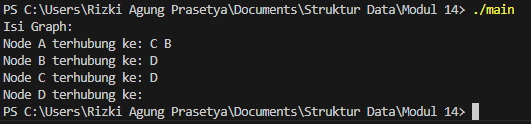
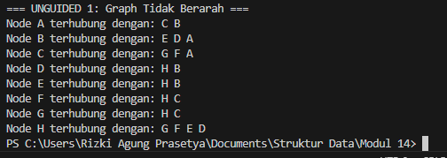
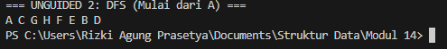
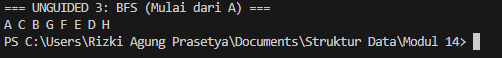

## 1. Nama, NIM, Kelas

- **Nama**: Rizki Agung Prasetya

- **NIM**: 103112400263

- **Kelas**: IF 12-05

  

## 2. Motivasi Belajar Struktur Data

Belajar struktur data itu bukan cuma soal bisa bikin kode jalan, tapi tentang bagaimana kita membangun pola pikir yang teratur. Ibarat kita menata buku di perpustakaan, kalau asal taruh pasti bikin pusing saat mencari. Tapi dengan sistem penyimpanan yang jelas, semua jadi mudah ditemukan. Sama halnya dengan struktur data semakin kita paham cara menyusun dan mengelola data, semakin efisien program yang kita buat. Selain bermanfaat di dunia pemrograman, cara berpikir logis dan efisien ini juga terbawa ke kehidupan sehari-hari. Jadi meskipun awalnya terasa berat, anggap saja setiap konsep struktur data adalah fondasi kuat yang akan mempermudah kita menghadapi tantangan teknologi di masa depan.

  

## 3. Dasar Teori

SStruktur data merupakan teknik dalam menyimpan serta mengatur data di dalam sistem komputer sehingga data tersebut dapat diakses dan diproses secara optimal. Salah satu struktur data yang penting untuk dipahami adalah Graph.

Graph adalah sebuah kumpulan elemen yang tidak kosong, terdiri atas simpul (node/vertex) dan penghubung antar simpul yang disebut sisi (edge). Dalam kehidupan nyata, graph dapat dianalogikan sebagai beberapa lokasi, seperti tempat kost dan laboratorium, yang direpresentasikan sebagai node, sedangkan jalur atau jalan yang menghubungkan lokasi tersebut berperan sebagai edge. Pada implementasi pemrograman, node utama menyimpan data, sementara edge berfungsi sebagai penghubung yang menyimpan alamat memori (address) menuju node tujuan, sehingga membentuk hubungan antar data.

Berdasarkan arah relasinya, graph dibagi menjadi dua jenis, yaitu graph berarah (Directed Graph) dan graph tidak berarah (Undirected Graph). Pada graph berarah, hubungan antar node memiliki arah tertentu, sehingga keterhubungan dari node A ke node B tidak selalu berarti node B terhubung kembali ke node A. Sebaliknya, pada graph tidak berarah, setiap hubungan antar node bersifat dua arah tanpa orientasi tertentu.

Dalam penyimpanan data di memori, graph dapat direpresentasikan menggunakan matriks ketetanggaan (array dua dimensi) maupun Multi Linked List. Namun, pada kegiatan praktikum, metode Multi Linked List lebih sering digunakan karena bersifat dinamis dan lebih fleksibel dalam menangani perubahan jumlah node maupun edge.

Konsep lain yang tidak kalah penting dalam graph adalah ketetanggaan, di mana dua node dikatakan bertetangga apabila dihubungkan secara langsung oleh sebuah edge. Untuk melakukan penelusuran seluruh node dalam graph, digunakan algoritma Breadth First Search (BFS) dan Depth First Search (DFS). BFS melakukan penelusuran secara melebar berdasarkan tingkat kedalaman, dimulai dari node awal, sedangkan DFS menelusuri graph dengan mendalami satu jalur terlebih dahulu hingga mencapai simpul terdalam sebelum kembali ke node sebelumnya.
  

## 4. Guided

### 4.1 Guided 1
```c++

#ifndef GRAPH_H
#define GRAPH_H
#include <iostream>
using namespace std;

typedef char infoGraph;
typedef struct ElmNode*adrNode;
typedef struct ElmEdge*adrEdge;

struct ElmNode{
    infoGraph info;
    bool visited;
    adrEdge firstEdge;
    adrNode next;
};

struct ElmEdge{
    adrNode node;
    adrEdge next;
};

struct Graph{
    adrNode first;
};

void createGraph(Graph &G);
adrNode allocateNode(infoGraph X);
void insertNode(Graph &G, infoGraph X);
void connectNode(Graph &G, infoGraph start, infoGraph end);
void printGraph(Graph G);

#endif

```

**Penjelasan :** Berkas graph.h berperan sebagai file header yang berisi definisi Abstract Data Type (ADT) beserta deklarasi struktur data untuk merepresentasikan graf menggunakan pendekatan adjacency list atau senarai berantai. Pada file ini didefinisikan beberapa struktur utama yang menjadi dasar pembentukan graph.

Struktur ElmNode digunakan untuk merepresentasikan simpul (node) yang menyimpan data, penanda status kunjungan (visited), serta pointer yang mengarah ke sisi pertama dan simpul selanjutnya. Sementara itu, struktur ElmEdge berfungsi sebagai representasi sisi (edge) yang menyimpan alamat simpul tujuan sebagai penghubung antar node. Selain itu, terdapat struktur Graph yang menyimpan alamat elemen pertama sebagai titik awal dari keseluruhan graph.

File ini juga mendefinisikan tipe data pointer seperti adrNode dan adrEdge untuk mempermudah pengelolaan alamat memori. Di samping itu, graph.h memuat deklarasi fungsi-fungsi dasar, meliputi pembuatan graph, alokasi node, penambahan simpul (insertNode), penghubungan antar simpul (connectNode), serta prosedur penelusuran graph menggunakan algoritma Depth First Search (DFS) dan Breadth First Search (BFS). Dengan adanya pemisahan antara deklarasi pada file header dan implementasi pada file sumber, struktur program menjadi lebih modular, terorganisir, dan mudah dikembangkan.


### 4.2 Guided 2
```c++

#include "graph.h"

void createGraph(Graph &G) {
    G.first = NULL;
}

adrNode allocateNode(infoGraph X) {
    adrNode P = new ElmNode;
    P->info = X;
    P->visited = false;
    P->firstEdge = NULL;
    P->next = NULL;
    return P;
}

void insertNode(Graph &G, infoGraph X) {
    adrNode P = allocateNode(X);
    if (G.first == NULL) {
        G.first = P;
    } else {
        adrNode Q = G.first;
        while (Q->next != NULL) {
            Q = Q->next;
        }
        Q->next = P;
    }
}


```

**Penjelasan** : Berkas graph_init.cpp berisi implementasi dari fungsi-fungsi dasar yang berfokus pada proses inisialisasi struktur data serta alokasi memori dalam pembentukan graph. File ini berperan penting dalam menyiapkan kondisi awal graph sebelum digunakan lebih lanjut.

Di dalamnya terdapat fungsi createGraph yang berfungsi untuk menginisialisasi graph dengan menetapkan pointer utama ke nilai NULL, sehingga graph berada pada keadaan awal yang kosong. Selain itu, terdapat fungsi allocateNode yang digunakan untuk menyediakan ruang memori bagi simpul baru sekaligus menginisialisasi atribut-atributnya, seperti pengisian data serta pengaturan status visited menjadi false.

File ini juga mengatur mekanisme penambahan simpul ke dalam graph melalui fungsi insertNode. Proses ini dilakukan dengan memanggil fungsi alokasi node, kemudian menelusuri daftar simpul yang telah ada hingga mencapai elemen terakhir. Selanjutnya, simpul baru tersebut disambungkan pada bagian akhir daftar (insert last), sehingga memungkinkan graph menyimpan dan mengelola node secara dinamis sesuai kebutuhan.


### 4.3 Guided 3
```c++
#include "graph.h"

adrNode findNode(Graph G, infoGraph X) {
    adrNode P = G.first;
    while (P != NULL) {
        if (P->info == X) return P;
        P = P->next;
    }
    return NULL;
}

void connectNode(Graph &G, infoGraph start, infoGraph end) {
    adrNode pStart = findNode(G, start);
    adrNode pEnd = findNode(G, end);

    if (pStart != NULL && pEnd != NULL) {
        adrEdge newEdge = new ElmEdge;
        newEdge->node = pEnd;
        newEdge->next = pStart->firstEdge; // Insert First di list Edge
        pStart->firstEdge = newEdge;
    }
} 

```

**Penjelasan** : Berkas graph_edge.cpp memuat implementasi logika yang berkaitan dengan pengelolaan hubungan antar simpul dalam graph. Proses diawali dengan fungsi findNode, yang melakukan penelusuran secara linear terhadap daftar simpul untuk menemukan alamat memori node berdasarkan nilai data yang dicari.

Fungsi utama dalam file ini adalah connectNode, yang berperan dalam membentuk relasi antara dua simpul yang valid. Relasi tersebut dibuat dengan cara mengalokasikan elemen edge baru yang menyimpan pointer menuju simpul tujuan. Secara implementatif, proses penambahan edge dilakukan menggunakan metode insert first, yaitu dengan menempatkan sisi baru di bagian awal daftar ketetanggaan (firstEdge) milik simpul asal. Pendekatan ini memungkinkan pembentukan dan pengelolaan hubungan antar node dilakukan secara efisien dalam struktur graph berbasis adjacency list.

### 4.4 Guided 4
```c++
#include "graph.h"

void printGraph(Graph G) {
    adrNode P = G.first;
    while (P != NULL) {
        cout << "Node " << P->info << " terhubung ke: ";
        adrEdge E = P->firstEdge;
        while (E != NULL) {
            cout << E->node->info << " ";
            E = E->next;
        }
        cout << endl;
        P = P->next;
    }
}

```

**Penjelasan** : Berkas graph_print.cpp berfungsi untuk menangani proses visualisasi struktur data graph dengan menampilkan daftar simpul beserta relasi ketetanggaannya pada layar konsol. File ini membantu pengguna memahami bentuk dan hubungan antar data yang tersimpan dalam graph.

Fungsi utama yang terdapat di dalamnya adalah printGraph, yang diimplementasikan menggunakan mekanisme perulangan bersarang (nested loop). Perulangan bagian luar digunakan untuk menelusuri daftar simpul utama secara berurutan, sedangkan perulangan bagian dalam digunakan untuk menelusuri daftar sisi yang dimiliki oleh setiap simpul. Dengan memanfaatkan pointer firstEdge dari simpul yang sedang diproses, fungsi ini menampilkan informasi simpul asal yang diikuti oleh seluruh simpul tujuan yang terhubung sebagai tetangganya. Melalui cara ini, struktur graph berbasis adjacency list dapat ditampilkan secara tekstual dengan jelas dan mudah dipahami.

### 4.5 Guided 5
```c++
#include "graph.h"
#include <iostream>

using namespace std;

int main() {
    Graph G;
    createGraph(G);

    // Menambahkan Node A, B, C, D
    insertNode(G, 'A');
    insertNode(G, 'B');
    insertNode(G, 'C');
    insertNode(G, 'D');

    // Menghubungkan Node (Sesuai contoh materi)
    connectNode(G, 'A', 'B'); // A ke B
    connectNode(G, 'A', 'C'); // A ke C
    connectNode(G, 'B', 'D'); // B ke D
    connectNode(G, 'C', 'D'); // C ke D

    cout << "Isi Graph:" << endl;
    printGraph(G);

    return 0;
}
```

**Penjelasan** : Berkas main.cpp berfungsi sebagai program utama (driver program) yang bertugas mengoordinasikan serta menguji seluruh fitur dari ADT Graph yang telah dideklarasikan pada file header. File ini menjadi titik awal eksekusi program sekaligus tempat pengujian integrasi seluruh modul graph.

Proses eksekusi diawali dengan pendefinisian variabel bertipe Graph, kemudian dilakukan inisialisasi awal menggunakan fungsi createGraph. Selanjutnya, tahap pembentukan simpul dilakukan dengan memanggil fungsi insertNode untuk menambahkan data simpul, misalnya dari karakter 'A' hingga 'D', ke dalam struktur graph. Setelah seluruh simpul berhasil dibuat, fungsi connectNode dipanggil untuk membentuk hubungan atau sisi antar simpul sesuai dengan topologi yang diinginkan. Pada tahap akhir, fungsi printGraph dijalankan untuk menampilkan struktur graph yang telah terbentuk ke layar konsol, sehingga hasil implementasi dapat diverifikasi dan dievaluasi kebenaran logikanya.

**Output** 

 

  
## 5. Unguided

### 5.1 Unguided 1
```c++

#include "graph.h"
#include <iostream>
using namespace std;

int main() {
    Graph G;
    createGraph(G);

    insertNode(G, 'A'); insertNode(G, 'B'); insertNode(G, 'C');
    insertNode(G, 'D'); insertNode(G, 'E'); insertNode(G, 'F');
    insertNode(G, 'G'); insertNode(G, 'H');

    connectNode(G, 'A', 'B'); connectNode(G, 'A', 'C');
    connectNode(G, 'B', 'D'); connectNode(G, 'B', 'E');
    connectNode(G, 'C', 'F'); connectNode(G, 'C', 'G');
    connectNode(G, 'D', 'H'); connectNode(G, 'E', 'H');
    connectNode(G, 'F', 'H'); connectNode(G, 'G', 'H');

    cout << "=== UNGUIDED 1: Graph Tidak Berarah ===" << endl;
    printGraph(G);

    return 0;
}

```


**Penjelasan :**  Pada Unguided 1, tugas utama yang diberikan adalah memodifikasi implementasi graph yang semula bersifat berarah (Directed Graph) menjadi tidak berarah (Undirected Graph). Jika pada latihan sebelumnya (Guided) hubungan antar simpul hanya berlaku satu arah—seperti jalur satu arah di mana node A dapat menuju node B, tetapi node B belum tentu memiliki jalur kembali ke A—maka pada tugas ini relasi antar node harus bersifat dua arah.

Untuk memenuhi kebutuhan tersebut, simpul-simpul dari A hingga H disusun sesuai dengan ilustrasi yang terdapat pada modul. Prinsip utama yang diterapkan adalah bahwa setiap koneksi antar simpul harus berlaku timbal balik, sehingga apabila simpul A terhubung ke simpul B, maka simpul B juga secara otomatis terhubung ke simpul A.

Implementasi penyelesaiannya difokuskan pada modifikasi fungsi connectNode. Logika program diubah agar setiap proses penghubungan dua simpul menghasilkan dua buah edge sekaligus, yaitu edge dari simpul asal ke simpul tujuan dan edge dari simpul tujuan kembali ke simpul asal. Setelah program dijalankan, hasil keluaran dari fungsi printGraph akan menampilkan daftar simpul beserta tetangga-tetangganya yang saling terhubung, sehingga dapat dibuktikan bahwa struktur graph yang terbentuk telah bersifat tidak berarah sesuai dengan ketentuan soal.


**Output** 

 


 ### 5.2 Unguided 2
```c++

#include "graph.h"
#include <iostream>
using namespace std;

int main() {
    Graph G;
    createGraph(G);

    insertNode(G, 'A'); insertNode(G, 'B'); insertNode(G, 'C');
    insertNode(G, 'D'); insertNode(G, 'E'); insertNode(G, 'F');
    insertNode(G, 'G'); insertNode(G, 'H');

    connectNode(G, 'A', 'B'); connectNode(G, 'A', 'C');
    connectNode(G, 'B', 'D'); connectNode(G, 'B', 'E');
    connectNode(G, 'C', 'F'); connectNode(G, 'C', 'G');
    connectNode(G, 'D', 'H'); connectNode(G, 'E', 'H');
    connectNode(G, 'F', 'H'); connectNode(G, 'G', 'H');

    cout << "=== UNGUIDED 2: DFS (Mulai dari A) ===" << endl;
    adrNode startNode = findNode(G, 'A');
    printDFS(G, startNode);
    cout << endl;

    return 0;
}
```

**Penjelasan :**Unguided 2 meminta kita untuk membuat fitur penelusuran graf menggunakan metode Depth First Search (DFS). Jika di latihan pertama kita hanya membangun "jalan" antar kota (node), di latihan ini kita diminta membuat program yang bisa menyusuri jalan tersebut dari awal sampai akhir. Cara kerja DFS ini mirip seperti orang yang sedang menjelajahi labirin: ia akan terus berjalan menelusuri satu lorong sedalam mungkin sampai mentok (tidak ada jalan lagi), baru kemudian dia mundur sedikit (backtracking) untuk mencari lorong lain yang belum pernah dilewati.

Dalam kodingannya, kita menggunakan teknik rekursif (fungsi yang memanggil dirinya sendiri) agar program bisa otomatis pindah dari satu node ke tetangganya yang paling dalam. Hal yang paling penting di sini adalah kita harus memberi "tanda" pada setiap node yang sudah didatangi (menggunakan status visited), supaya program tidak bingung dan berputar-putar di tempat yang sama. Hasil akhirnya nanti berupa deretan huruf yang muncul di layar, menunjukkan urutan perjalanan program dari node pertama hingga node terakhir yang berhasil ditemukan.

**Output** 

 
  

  ### 5.3 Unguided 3
```c++
#include "graph.h"
#include <iostream>
using namespace std;

int main() {
    Graph G;
    createGraph(G);

    insertNode(G, 'A'); insertNode(G, 'B'); insertNode(G, 'C');
    insertNode(G, 'D'); insertNode(G, 'E'); insertNode(G, 'F');
    insertNode(G, 'G'); insertNode(G, 'H');

    connectNode(G, 'A', 'B'); connectNode(G, 'A', 'C');
    connectNode(G, 'B', 'D'); connectNode(G, 'B', 'E');
    connectNode(G, 'C', 'F'); connectNode(G, 'C', 'G');
    connectNode(G, 'D', 'H'); connectNode(G, 'E', 'H');
    connectNode(G, 'F', 'H'); connectNode(G, 'G', 'H');

    cout << "=== UNGUIDED 3: BFS (Mulai dari A) ===" << endl;
    adrNode startNode = findNode(G, 'A');
    printBFS(G, startNode);
    cout << endl;

    return 0;
}
```

**Penjelasan :**Pada Unguided 3, tugas yang diberikan adalah mengimplementasikan algoritma penelusuran graph menggunakan metode Breadth First Search (BFS). Berbeda dengan Depth First Search (DFS) yang menelusuri graph dengan mendalami satu jalur terlebih dahulu hingga mencapai simpul terdalam, BFS bekerja dengan cara menelusuri graph secara melebar berdasarkan tingkat atau level.

Proses penelusuran BFS dimulai dari sebuah simpul awal, kemudian dilanjutkan dengan mengunjungi seluruh simpul tetangga terdekatnya terlebih dahulu sebelum berpindah ke simpul pada tingkat berikutnya. Dengan pendekatan ini, BFS memastikan bahwa semua simpul yang berada pada jarak terdekat dari simpul awal dikunjungi lebih dulu sebelum melanjutkan ke simpul yang lebih jauh.

Secara implementasi, algoritma BFS memanfaatkan struktur data Queue (antrian). Prinsip kerjanya mengikuti konsep First In First Out (FIFO), di mana simpul yang pertama kali dimasukkan ke dalam antrian akan diproses terlebih dahulu. Setiap kali sebuah simpul diproses, seluruh simpul tetangganya yang belum pernah dikunjungi akan dimasukkan ke dalam antrian. Proses ini terus berlanjut hingga antrian kosong, dengan tetap menggunakan penanda visited untuk memastikan bahwa setiap simpul hanya dikunjungi satu kali selama proses penelusuran berlangsung.

**Output** 

 

## 6. Kesimpulan

Struktur data Graph dengan metode Adjacency List bersifat dinamis dan efisien dalam merepresentasikan hubungan antar simpul. Pada praktikum ini, konsep graph berarah dikembangkan menjadi graph tidak berarah dengan memastikan setiap koneksi memiliki hubungan timbal balik. Pemahaman struktur graph diperkuat melalui penerapan algoritma DFS dan BFS, yang menunjukkan bagaimana relasi data dapat ditelusuri secara sistematis dan terstruktur.

## 7. Referensi

1. Sedgewick, R. (2002) Algorithms in C++ Part 5: Graph Algorithms. 3rd edn. Boston: Addison-Wesley Professional.
2. GeeksforGeeks. “Graph Data Structure and Algorithms.” (https://www.geeksforgeeks.org/graph-data-structure-and-algorithms/)
3. W3Schools. “C++ Pointers.” (https://www.w3schools.com/cpp/cpp_pointers.asp)
