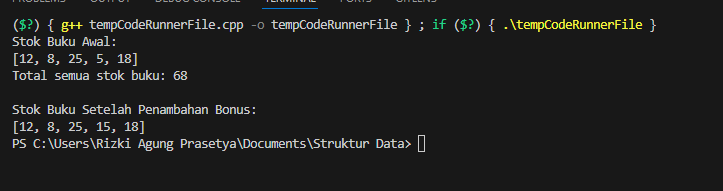

## 1. Nama, NIM, Kelas

- **Nama**: Rizki Agung Prasetya

- **NIM**: 103112400263

- **Kelas**: IF 12-05

  

## 2. Motivasi Belajar Struktur Data

Belajar struktur data itu bukan cuma soal bisa bikin kode jalan, tapi tentang bagaimana kita membangun pola pikir yang teratur. Ibarat kita menata buku di perpustakaan, kalau asal taruh pasti bikin pusing saat mencari. Tapi dengan sistem penyimpanan yang jelas, semua jadi mudah ditemukan. Sama halnya dengan struktur data semakin kita paham cara menyusun dan mengelola data, semakin efisien program yang kita buat. Selain bermanfaat di dunia pemrograman, cara berpikir logis dan efisien ini juga terbawa ke kehidupan sehari-hari. Jadi meskipun awalnya terasa berat, anggap saja setiap konsep struktur data adalah fondasi kuat yang akan mempermudah kita menghadapi tantangan teknologi di masa depan.

  

## 3. Dasar Teori

Struktur data adalah metode untuk menyimpan sekaligus mengatur data dalam komputer sehingga dapat diakses dan dikelola dengan lebih efektif. Berikut penjelasan dasar mengenai Array, Pointer, dan Fungsi:

Konsep Array dan Pengolahan Data

Array merupakan struktur data yang digunakan untuk menampung sejumlah nilai dengan tipe yang sama dalam satu variabel. Dalam C++, elemen-elemen array tersusun secara berurutan di memori sehingga dapat diakses melalui indeks, misalnya arr[i]. Penggunaan array sangat membantu ketika bekerja dengan data berjumlah banyak, seperti menyimpan daftar nilai siswa atau data persediaan barang. Seperti yang dijelaskan oleh Kusuma & Rahmadani (2023), array menjadi pondasi penting karena mendukung penyimpanan dan pengolahan informasi secara rapi serta efisien.

Pointer dan Pengelolaan Memori

Pointer adalah variabel khusus yang menyimpan alamat memori dari variabel lain. Dengan menggunakan pointer, program dapat mengakses atau mengubah nilai suatu variabel secara langsung melalui alamat tersebut, bukan melalui salinannya. Hal ini membuat pengolahan data lebih cepat dan fleksibel. Misalnya, dalam program pengelolaan diskon atau stok barang, pointer memungkinkan perubahan data asli tanpa perlu menyalinnya terlebih dahulu. Menurut Santoso & Wirawan (2022), pemahaman tentang pointer sangat penting untuk memahami mekanisme memori komputer dan efisiensi manipulasi data di C dan C++.

Fungsi dan Parameter Referensi

Fungsi dalam C++ berperan untuk membagi program menjadi bagian-bagian kecil yang lebih mudah dikelola serta bisa digunakan kembali. Salah satu konsep penting pada fungsi adalah pass by reference, yaitu pengiriman variabel ke fungsi dalam bentuk referensi, bukan salinan. Dengan cara ini, setiap perubahan yang dilakukan di dalam fungsi langsung berpengaruh pada variabel aslinya. Putri & Nugroho (2021) menyebutkan bahwa penggunaan parameter referensi tidak hanya membuat pemrosesan data lebih efisien, tetapi juga mendukung prinsip modularitas dalam pengembangan program.
  

## 4. Guided

### 4.1 Guided 1
```c++

#include <iostream>

using namespace std;

int main(){
    int BukuPerHari[7] = {2,1,3,2,4,5,1};
    int TotalBuku = 0;

    cout << "Laporan baca buku mingguan" << endl;

    for (int i = 0; i < 7; i ++){
        cout << "Hari ke-" << i + 1 << ":" << BukuPerHari[i] << " buku." << endl;
        TotalBuku += BukuPerHari[i];
    }
    cout << "total buku yang dibaca minggu ini : " << TotalBuku << " buku." << endl;
}
```

**Penjelasan :** Program ini digunakan untuk menampilkan laporan jumlah buku yang dibaca selama seminggu. Data jumlah buku setiap hari disimpan di dalam array BukuPerHari, kemudian ditampilkan satu per satu mulai dari hari ke-1 sampai hari ke-7. Selain itu, program juga menghitung total buku yang dibaca selama seminggu dan menampilkannya di akhir laporan.

**Output**

 
  

### 4.2 Guided 2
```c++
#include <iostream>

using namespace std;

int main(){
    float hargaproduk = 50000.0;
    //Deklarasi pointer
    float* ptrharga;
    ptrharga = &hargaproduk;
    
    cout<<"Harga Awal Produk Rp"<< hargaproduk<<endl;
    cout<<"Alamat memori harga"<<ptrharga<<endl;

    cout<<"\n..memberikan diskon 10% melalui pointer..." << endl;
    *ptrharga = *ptrharga * 0.9;
    
    cout<<"Harga Akhir Produk Rp"<< *ptrharga<<endl;
    return 0;
}
```

**Penjelasan** : Program ini digunakan untuk menunjukkan cara penggunaan pointer dalam memanipulasi data. Variabel hargaproduk menyimpan harga awal produk sebesar Rp50.000. Kemudian dibuat pointer ptrharga yang menyimpan alamat memori dari hargaproduk.

Program pertama menampilkan harga awal dan alamat memorinya. Setelah itu, melalui pointer, nilai hargaproduk dikalikan 0.9 (diskon 10%). Hasilnya, harga produk berkurang menjadi Rp45.000 dan ditampilkan ke layar.

**Output**

 

  

### 4.3 Guided 3
```c++
#include <iostream>
#include <string>
using namespace std;

float hitungRataRata(int nilaiTugas, int nilaiUTS) {
    return (nilaiTugas + nilaiUTS) / 2.0f;
}

void cetakProfil(string nama, float nilai) {
    cout << "Nama  : " << nama << endl;
    cout << "Nilai : " << nilai << endl;
}


void beriNilaiBonus(float &nilai) {
    nilai += 5.0f;
}

int main() {
    string namaSiswa = "Rizki";
    int tugas = 80, uts = 90;

    float nilaiAkhir = hitungRataRata(tugas, uts);

    cout << "\nProfil Awal" << endl;
    cetakProfil(namaSiswa, nilaiAkhir);

    cout << "\nMemberikan nilai bonus..." << endl;
    beriNilaiBonus(nilaiAkhir);

    cout << "\nProfil Setelah Bonus" << endl;
    cetakProfil(namaSiswa, nilaiAkhir);

    return 0;
}

```


**Penjelasan :** Program ini digunakan untuk menghitung dan menampilkan nilai seorang siswa sebelum dan sesudah mendapat bonus. Pertama, fungsi hitungRataRata() menghitung nilai rata-rata dari nilai tugas dan UTS dengan rumus (nilaiTugas + nilaiUTS) / 2.0f. Lalu, fungsi cetakProfil() menampilkan nama siswa dan nilai yang diperoleh ke layar. Fungsi beriNilaiBonus() menambah nilai siswa sebesar 5 menggunakan parameter referensi (float& nilai), sehingga perubahan nilai langsung berpengaruh pada variabel aslinya. Di dalam fungsi main(), nama siswa diset ke "Rizki" dengan nilai tugas 80 dan UTS 90. Program menghitung nilai rata-rata, menampilkan profil awal, kemudian memberikan bonus 5 poin, dan terakhir menampilkan profil siswa setelah mendapat bonus.

**Output**

 
  

## 5. Unguided

### 5.1 Unguided 1
```c++

#include <iostream>
using namespace std;
void cetakStok(int arr[], int size) {
    cout << "[";
    for (int i = 0; i < size; i++) {
        cout << arr[i] << (i == size - 1 ? "" : ", ");
    }
    cout << "]" << endl;
}

int hitungTotalStok(int arr[], int size) {
    int total = 0;
    for (int i = 0; i < size; i++) {
        total += arr[i];
    }
    return total;
}

int* cariStokPalingSedikit(int arr[], int size) {
    int* ptrPalingSedikit = &arr[0];
    for (int i = 1; i < size; i++) {
        if (arr[i] < *ptrPalingSedikit) {
            ptrPalingSedikit = &arr[i];
        }
    }
    return ptrPalingSedikit;
}

void tambahStokBonus(int* ptrStok) {
    *ptrStok += 10;
}

int main() {
    int stokBuku[] = {12, 8, 25, 5, 18};
    int jumlahJenisBuku = 5;

    cout << "Stok Buku Awal:" << endl;
    cetakStok(stokBuku, jumlahJenisBuku);

    int total = hitungTotalStok(stokBuku, jumlahJenisBuku);
    cout << "Total semua stok buku: " << total << endl;


    int* ptrStokRendah = cariStokPalingSedikit(stokBuku, jumlahJenisBuku);
    tambahStokBonus(ptrStokRendah);

    cout << "\nStok Buku Setelah Penambahan Bonus:" << endl;
    cetakStok(stokBuku, jumlahJenisBuku);

    return 0;
}

```


**Penjelasan :**  Program ini digunakan untuk mengelola data stok buku menggunakan array dan pointer. Fungsi cetakStok() menampilkan isi array stok buku dengan format daftar yang rapi. Fungsi hitungTotalStok() menghitung total semua stok dengan menjumlahkan elemen-elemen dalam array. Fungsi cariStokPalingSedikit() mencari nilai stok terkecil dengan membandingkan setiap elemen array, kemudian mengembalikan alamat memorinya dalam bentuk pointer. Selanjutnya, fungsi tambahStokBonus() menambahkan stok sebanyak 10 pada elemen dengan nilai stok paling sedikit menggunakan pointer tersebut. Pada fungsi main(), data awal stok buku disimpan dalam array stokBuku, lalu program menampilkan stok awal, menghitung total stok, mencari buku dengan stok terendah, memberikan tambahan stok bonus, dan terakhir menampilkan stok buku setelah penambahan dilakukan.


**Output** 

 

  
  

## 6. Kesimpulan

Dari pembahasan berbagai program C++, dapat disimpulkan bahwa penguasaan konsep dasar seperti array, pointer, fungsi, parameter referensi, dan operasi aritmetika merupakan hal yang sangat penting dalam pemrograman. Array membantu menyimpan dan mengelola data dalam jumlah banyak secara lebih teratur, sementara pointer memberikan kendali langsung terhadap data melalui alamat memori sehingga lebih fleksibel dan efisien. Penggunaan parameter referensi pada fungsi memungkinkan perubahan nilai variabel tanpa perlu menyalin data, mendukung prinsip modular dan efisiensi program. Operasi aritmetika pada tipe data numerik juga mendukung perhitungan yang akurat sesuai kebutuhan. Dengan memahami dan menerapkan konsep-konsep ini, seorang programmer dapat membuat program yang lebih terstruktur, efisien, serta siap untuk menangani masalah pemrograman yang lebih kompleks.
  

## 7. Referensi

1. GeeksforGeeks. “Pembahasan pointers.” [\[https://www.geeksforgeeks.org/c-plus-plus/\](https://www.geeksforgeeks.org/c-plus-plus/)](https://www.geeksforgeeks.org/cpp/cpp-pointers/)

2. W3Schools. “C++ Pointers.” [text](https://www.w3schools.com/cpp/cpp_pointers.asp)