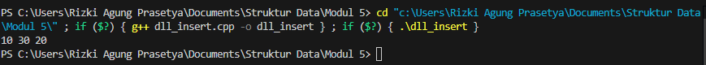
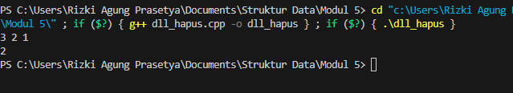
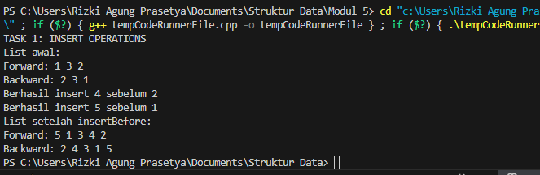
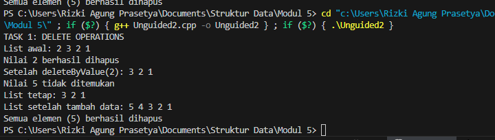
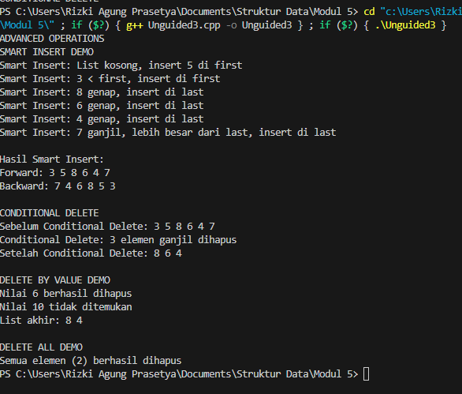

## 1. Nama, NIM, Kelas

- **Nama**: Rizki Agung Prasetya

- **NIM**: 103112400263

- **Kelas**: IF 12-05

  

## 2. Motivasi Belajar Struktur Data

Belajar struktur data itu bukan cuma soal bisa bikin kode jalan, tapi tentang bagaimana kita membangun pola pikir yang teratur. Ibarat kita menata buku di perpustakaan, kalau asal taruh pasti bikin pusing saat mencari. Tapi dengan sistem penyimpanan yang jelas, semua jadi mudah ditemukan. Sama halnya dengan struktur data semakin kita paham cara menyusun dan mengelola data, semakin efisien program yang kita buat. Selain bermanfaat di dunia pemrograman, cara berpikir logis dan efisien ini juga terbawa ke kehidupan sehari-hari. Jadi meskipun awalnya terasa berat, anggap saja setiap konsep struktur data adalah fondasi kuat yang akan mempermudah kita menghadapi tantangan teknologi di masa depan.

  

## 3. Dasar Teori

Struktur data merupakan metode untuk mengelola dan menyimpan data di dalam komputer agar dapat diakses dan diproses dengan efisien. Dalam mata kuliah Struktur Data, salah satu struktur yang banyak digunakan adalah Linked List, terutama Double Linked List (DLL). Struktur ini bermanfaat ketika dibutuhkan penyimpanan data yang bersifat dinamis dan fleksibel, serta memungkinkan penambahan atau penghapusan elemen di berbagai posisi dalam daftar dengan mudah.
  

## 4. Guided

### 4.1 Guided 1
```c++

#include <iostream>
#define Nil NULL
using namespace std;

typedef int infotype;
typedef struct elmlist *address;

struct elmlist {
    infotype info;
    address next;
    address prev;
};

struct List {
    address first;
    address last;
};

void insertFirst(List &L, address P) {
    P->next = L.first; // Set pointer next dari P ke elemen pertama saat ini
    P->prev = Nil; // Set pointer prev P ke Nil karena menjadi elemen pertama
    if (L.first != Nil) L.first->prev = P; // Jika list tidak kosong, set prev elemen pertama lama ke P
    else L.last = P; // Jika lits kosong, set last juga ke P
    L.first = P; //Update first list menjadi P
}

void insertLast(List &L, address P, address R) {
    P->prev = L.last; // Set pointer prev dari P ke elemen terakhir saat ini
    P->next = Nil; 
    if (L.last != Nil) L.last->next = P;
    else L.first = P;
    L.last = P;
}

void insertAfter(List &L, address P, address R) {
    P->next = R->next; // Set pointer next dari P ke elemen setelah R
    P->prev = R; // Set pointer prev dari P ke R
    if (R->next != Nil) R->next->prev = P; // Jika R bukan elemen terakhir, set prev elemen setelah R ke P
    else L.last = P; // Jika R adalah elemen terakhir, update last list menjadi P
    R->next = P; // Set pointer next dari R ke P
}

address alokasi(infotype x) {
    address P = new elmlist; // Alokasi memori untuk elemen baru
    P->info = x; // Set info elemen baru
    P->next = Nil; // Inisialisasi next ke Nil
    P->prev = Nil; // Inisialisasi prev ke Nil
    return P; // Kembalikan alamat elemen baru
}

void printInfo(List L) {
    address P = L.first; // Set P ke elemen pertama list
    while (P != Nil) { // Loop selama P tidak Nil
        cout << P->info << " "; // Cetak info dari P
        P = P->next; // Pindah ke elemen berikutnya
    }
    cout << endl;
}
int main() {
    List L;
    L.first = Nil;
    L.last = Nil;

    address P1 = alokasi(10);
    address P2 = alokasi(20);
    address P3 = alokasi(30);

    insertFirst(L, P1); // Insert 10 at the beginning
    insertLast(L, P2, L.last); // Insert 20 at the end
    insertAfter(L, P3, P1); // Insert 30 after 10

    printInfo(L); // Expected output: 10 30 20

    return 0;
}
```

**Penjelasan :** Kode ini membangun struktur data Doubly Linked List (DLL), yang terdiri dari node (elmlist) dengan pointer next dan prev, serta sebuah struktur List yang menyimpan pointer ke elemen pertama (first) dan terakhir (last). Program ini memiliki fungsi utama untuk menambahkan node di tiga posisi: insertFirst (menyisipkan di awal), insertLast (menyisipkan di akhir), dan insertAfter (menyisipkan di tengah, setelah node tertentu). Pada fungsi main, operasi dilakukan dengan menambahkan nilai 10 di awal, 20 di akhir, dan 30 setelah 10. Setelah semua penyisipan selesai, fungsi printInfo menampilkan hasil akhir berupa urutan data: 10 30 20.

**Output**

 
  

### 4.2 Guided 2
```c++
#include <iostream>
using namespace std;
#define Nil NULL

typedef int infotype;
typedef struct elmlist *address;

struct elmlist {
    infotype info;
    address next;
    address prev;
};

struct List {
    address first;
    address last;
};

address alokasi(infotype x) {
    address P = new elmlist;
    P -> info = x; P -> next = Nil; P -> prev = Nil; return P;
}
void dealokasi(address &P) { delete P; P = Nil; }
void insertFirst(List &L, address P) {
    P -> next = L.first; P -> prev = Nil;
    if (L.first != Nil) L.first -> prev = P; else L.last = P;
    L.first = P;
}

void printInfo(List L) {
    address P = L.first; while (P != Nil) { cout << P -> info << " "; P = P -> next; } cout << endl;
}
void deleteFirst(List &L, address &P) {
    P = L.first; L.first = L.first -> next;
    if (L.first != Nil) L.first -> prev = Nil; else L.last = Nil;
    P -> next = Nil; P -> prev = Nil;
}

void deleteLast(List &L, address &P) {
    P = L.last; L.last = L.last -> prev;
    if (L.last != Nil) L.last -> next = Nil; else L.first = Nil;
    P -> prev = Nil; P -> next = Nil;
}

void deleteAfter(List &L, address &P, address R) {
    P = R -> next; R -> next = P -> next;
    if (P -> next != Nil) P -> next -> prev = R; else L.last = R;
    P -> prev = Nil; P -> next = Nil;
}

int main() {
    List L; L.first = Nil; L.last = Nil;
    insertFirst(L, alokasi(1)); insertFirst(L, alokasi(2)); insertFirst(L, alokasi(3));
    printInfo(L);
    address P; deleteFirst(L, P); dealokasi(P);
    deleteAfter(L, P, L.first); dealokasi(P);
    printInfo(L);
    return 0;
}
```

**Penjelasan** : Program ini mengimplementasikan dan memanipulasi Double Linked List (DLL), yaitu struktur data di mana setiap elemen saling terhubung ke dua arah. Awalnya, program membuat tiga data (1, 2, dan 3) dan menambahkannya ke bagian depan list, menghasilkan urutan 3 2 1. Selanjutnya, elemen pertama (3) dihapus menggunakan deleteFirst, kemudian elemen setelah elemen pertama (yaitu 1) dihapus melalui deleteAfter. Pada akhir proses, list hanya berisi satu elemen, yaitu 2. Program ini memperlihatkan cara melakukan operasi penambahan dan penghapusan elemen pada Double Linked List secara tepat.

**Output**

 

  
## 5. Unguided

### 5.1 Unguided 1
```c++

#include <iostream>
#define Nil NULL

using namespace std;

typedef int infotype;
typedef struct elmlist *address;

struct elmlist {
    infotype info;
    address next;
    address prev;
};

struct List {
    address first;
    address last;
};

address alokasi(infotype x) {
    address P = new elmlist;
    P->info = x;
    P->next = Nil;
    P->prev = Nil;
    return P;
}

void insertFirst(List &L, address P) {
    P->next = L.first;
    P->prev = Nil;
    if (L.first != Nil)
        L.first->prev = P;
    else
        L.last = P;
    L.first = P;
}

void insertLast(List &L, address P) {
    P->prev = L.last;
    P->next = Nil;
    if (L.last != Nil)
        L.last->next = P;
    else
        L.first = P;
    L.last = P;
}

void insertAfter(List &L, address P, address R) {
    P->next = R->next;
    P->prev = R;
    if (R->next != Nil)
        R->next->prev = P;
    else
        L.last = P;
    R->next = P;
}

void insertBefore(List &L, infotype X, infotype sebelum) {
    address Q = L.first;
    while (Q != Nil && Q->info != sebelum) {
        Q = Q->next;
    }

    if (Q == Nil) {
        cout << "Elemen " << sebelum << " tidak ditemukan!\n";
        return;
    }

    address P = alokasi(X);

    if (Q == L.first) {
        insertFirst(L, P);
    } else {
        P->prev = Q->prev;
        P->next = Q;
        Q->prev->next = P;
        Q->prev = P;
    }

    cout << "Berhasil insert " << X << " sebelum " << sebelum << endl;
}

void printForward(List L) {
    address P = L.first;
    while (P != Nil) {
        cout << P->info << " ";
        P = P->next;
    }
    cout << endl;
}

void printReverse(List L) {
    address P = L.last;
    while (P != Nil) {
        cout << P->info << " ";
        P = P->prev;
    }
    cout << endl;
}

int main() {
    List L;
    L.first = Nil;
    L.last = Nil;

    cout << "TASK 1: INSERT OPERATIONS" << endl;

    address P1 = alokasi(1);
    insertFirst(L, P1);
    address P2 = alokasi(2);
    insertLast(L, P2);
    address P3 = alokasi(3);
    insertAfter(L, P3, P1);

    cout << "List awal:" << endl;
    cout << "Forward: ";
    printForward(L);
    cout << "Backward: ";
    printReverse(L);

    insertBefore(L, 4, 2);
    insertBefore(L, 5, 1);

    cout << "List setelah insertBefore:" << endl;
    cout << "Forward: ";
    printForward(L);
    cout << "Backward: ";
    printReverse(L);

    return 0;
}

```


**Penjelasan :**  Program ini merupakan implementasi dari Double Linked List (DLL) yang mampu menambahkan elemen di awal, akhir, setelah, maupun sebelum elemen tertentu. Program ini menggunakan dua struktur utama: elmlist, yang berfungsi sebagai node penyimpan data serta pointer ke elemen sebelumnya dan berikutnya, dan List, yang menyimpan pointer ke elemen pertama (first) dan terakhir (last). Fungsi alokasi digunakan untuk membuat node baru, sedangkan insertFirst, insertLast, dan insertAfter berfungsi untuk menambahkan elemen di depan, di belakang, dan setelah elemen tertentu. Sementara itu, insertBefore digunakan untuk menambah elemen sebelum data tertentu; apabila data yang dicari tidak ditemukan, program akan menampilkan pesan kesalahan. Pada fungsi main, list yang awalnya kosong diisi dengan data 1 di awal, 2 di akhir, dan 3 setelah 1, membentuk urutan 1 3 2. Selanjutnya, angka 4 disisipkan sebelum 2 dan angka 5 sebelum 1, sehingga urutan akhirnya menjadi 5 1 3 4 2. Program kemudian menampilkan isi list secara maju dan mundur untuk membuktikan bahwa setiap node terhubung dua arah dengan benar.


**Output** 

 


 ### 5.2 Unguided 2
```c++

#include <iostream>
#define Nil NULL

using namespace std;

typedef int infotype;
typedef struct elmlist *address;

struct elmlist {
    infotype info;
    address next;
    address prev;
};

struct List {
    address first;
    address last;
};

address alokasi(infotype x) {
    address P = new elmlist;
    P->info = x;
    P->next = Nil;
    P->prev = Nil;
    return P;
}

void dealokasi(address &P) {
    delete P;
    P = Nil;
}

void insertFirst(List &L, address P) {
    P->next = L.first;
    P->prev = Nil;
    if (L.first != Nil)
        L.first->prev = P;
    else
        L.last = P;
    L.first = P;
}

void insertLast(List &L, address P) {
    P->prev = L.last;
    P->next = Nil;
    if (L.last != Nil)
        L.last->next = P;
    else
        L.first = P;
    L.last = P;
}

void printInfo(List L) {
    address P = L.first;
    while (P != Nil) {
        cout << P->info << " ";
        P = P->next;
    }
    cout << endl;
}

void deleteFirst(List &L, address &P) {
    P = L.first;
    if (P != Nil) {
        L.first = P->next;
        if (L.first != Nil)
            L.first->prev = Nil;
        else
            L.last = Nil;
        P->next = Nil;
        P->prev = Nil;
    }
}

void deleteLast(List &L, address &P) {
    P = L.last;
    if (P != Nil) {
        L.last = P->prev;
        if (L.last != Nil)
            L.last->next = Nil;
        else
            L.first = Nil;
        P->next = Nil;
        P->prev = Nil;
    }
}

void deleteAfter(List &L, address &P, address R) {
    P = R->next;
    if (P != Nil) {
        R->next = P->next;
        if (P->next != Nil)
            P->next->prev = R;
        else
            L.last = R;
        P->next = Nil;
        P->prev = Nil;
    }
}

void deleteByValue(List &L, infotype X) {
    address P = L.first;

    while (P != Nil && P->info != X) {
        P = P->next;
    }
    if (P == Nil) {
        cout << "Nilai " << X << " tidak ditemukan" << endl;
        return;
    }
    if (P == L.first) {
        deleteFirst(L, P);
    } else if (P == L.last) {
        deleteLast(L, P);
    } else {
        P->prev->next = P->next;
        P->next->prev = P->prev;
    }

    cout << "Nilai " << X << " berhasil dihapus" << endl;
    dealokasi(P);
}

void deleteAll(List &L) {
    address P;
    int count = 0;
    while (L.first != Nil) {
        deleteFirst(L, P);
        dealokasi(P);
        count++;
    }
    cout << "Semua elemen (" << count << ") berhasil dihapus" << endl;
}

int main() {
    List L;
    L.first = Nil;
    L.last = Nil;
    cout << "TASK 1: DELETE OPERATIONS" << endl;

    insertFirst(L, alokasi(1));
    insertFirst(L, alokasi(2));
    insertFirst(L, alokasi(3));
    insertFirst(L, alokasi(2));

    cout << "List awal: ";
    printInfo(L);

    deleteByValue(L, 2);
    cout << "Setelah deleteByValue(2): ";
    printInfo(L);

    deleteByValue(L, 5);
    cout << "List tetap: ";
    printInfo(L);

    insertFirst(L, alokasi(4));
    insertFirst(L, alokasi(5));

    cout << "List setelah tambah data: ";
    printInfo(L);

    deleteAll(L);

    return 0;
}

```

**Penjelasan :**Program ini merupakan implementasi dari Double Linked List (DLL) yang menyediakan berbagai operasi untuk menghapus data, baik berdasarkan posisi maupun nilai tertentu. Program ini terdiri dari dua struktur utama: elmlist, yang berfungsi sebagai node penyimpan data (info) serta penunjuk ke elemen berikut (next) dan sebelumnya (prev), serta List, yang menyimpan alamat elemen pertama (first) dan terakhir (last). Fungsi alokasi digunakan untuk membuat node baru, sedangkan dealokasi berfungsi menghapus node dari memori untuk mencegah kebocoran memori. Program juga memiliki beberapa operasi penting seperti insertFirst dan insertLast untuk menambahkan elemen di awal atau akhir list, serta printInfo untuk menampilkan seluruh isi list.
Operasi penghapusan mencakup deleteFirst untuk menghapus elemen pertama, deleteLast untuk menghapus elemen terakhir, deleteAfter untuk menghapus elemen setelah node tertentu, deleteByValue untuk mencari dan menghapus elemen berdasarkan nilai, dan deleteAll untuk menghapus semua elemen dalam list.
Pada fungsi main, list diisi dengan data 2, 3, 2, dan 1. Kemudian dilakukan penghapusan nilai 2 menggunakan deleteByValue(2) sehingga hanya satu elemen bernilai 2 yang terhapus. Jika nilai yang dicari tidak ditemukan (misalnya deleteByValue(5)), program akan menampilkan pesan bahwa nilai tersebut tidak ada. Setelah itu, data 4 dan 5 ditambahkan kembali, lalu seluruh elemen dihapus menggunakan deleteAll. Secara keseluruhan, program ini menunjukkan cara menambah, mencari, dan menghapus elemen pada Double Linked List dengan tetap menjaga keterhubungan dua arah antar node agar struktur list tetap stabil dan konsisten.
  

**Output** 

 


 ### 5.3 Unguided 3
```c++

#include <iostream>
#define Nil NULL

using namespace std;

typedef int infotype;
typedef struct elmlist *address;

struct elmlist {
    infotype info;
    address next;
    address prev;
};

struct List {
    address first;
    address last;
};

address alokasi(infotype x) {
    address P = new elmlist;
    P->info = x;
    P->next = Nil;
    P->prev = Nil;
    return P;
}

void dealokasi(address &P) {
    delete P;
    P = Nil;
}

void insertFirst(List &L, address P) {
    P->next = L.first;
    P->prev = Nil;
    if (L.first != Nil)
        L.first->prev = P;
    else
        L.last = P;
    L.first = P;
}

void insertLast(List &L, address P) {
    P->prev = L.last;
    P->next = Nil;
    if (L.last != Nil)
        L.last->next = P;
    else
        L.first = P;
    L.last = P;
}

void insertAfter(List &L, address P, address Prec) {
    P->next = Prec->next;
    P->prev = Prec;
    if (Prec->next != Nil)
        Prec->next->prev = P;
    else
        L.last = P;
    Prec->next = P;
}

void printForward(List L) {
    address P = L.first;
    while (P != Nil) {
        cout << P->info << " ";
        P = P->next;
    }
    cout << endl;
}

void printBackward(List L) {
    address P = L.last;
    while (P != Nil) {
        cout << P->info << " ";
        P = P->prev;
    }
    cout << endl;
}

void deleteFirst(List &L, address &P) {
    P = L.first;
    if (P != Nil) {
        L.first = P->next;
        if (L.first != Nil)
            L.first->prev = Nil;
        else
            L.last = Nil;
        P->next = Nil;
        P->prev = Nil;
    }
}

void deleteLast(List &L, address &P) {
    P = L.last;
    if (P != Nil) {
        L.last = P->prev;
        if (L.last != Nil)
            L.last->next = Nil;
        else
            L.first = Nil;
        P->next = Nil;
        P->prev = Nil;
    }
}


void smartInsert(List &L, infotype X) {
    address P = alokasi(X);

    if (L.first == Nil) {
        insertFirst(L, P);
        cout << "Smart Insert: List kosong, insert " << X << " di first" << endl;
        return;
    }

    if (X < L.first->info) {
        insertFirst(L, P);
        cout << "Smart Insert: " << X << " < first, insert di first" << endl;
        return;
    }

    if (X % 2 == 0) {
        insertLast(L, P);
        cout << "Smart Insert: " << X << " genap, insert di last" << endl;
        return;
    }

    if (X > L.last->info) {
        insertLast(L, P);
        cout << "Smart Insert: " << X << " ganjil, lebih besar dari last, insert di last" << endl;
        return;
    }

    address Q = L.first;
    while (Q->next != Nil && !(Q->info == 5 && Q->next->info == 7)) {
        Q = Q->next;
    }

    if (Q->next != Nil) {
        insertAfter(L, P, Q);
        cout << "Smart Insert: " << X << " di antara 5 dan 7" << endl;
    } else {
        insertLast(L, P);
        cout << "Smart Insert: kondisi lain, insert di last" << endl;
    }
}

int conditionalDelete(List &L) {
    int count = 0;
    address P = L.first;
    while (P != Nil) {
        address nextP = P->next;
        if (P->info % 2 != 0) {
            if (P == L.first)
                deleteFirst(L, P);
            else if (P == L.last)
                deleteLast(L, P);
            else {
                P->prev->next = P->next;
                P->next->prev = P->prev;
            }
            dealokasi(P);
            count++;
        }
        P = nextP;
    }
    return count;
}

void deleteByValue(List &L, infotype X) {
    address P = L.first;
    while (P != Nil && P->info != X) {
        P = P->next;
    }
    if (P == Nil) {
        cout << "Nilai " << X << " tidak ditemukan" << endl;
        return;
    }

    if (P == L.first)
        deleteFirst(L, P);
    else if (P == L.last)
        deleteLast(L, P);
    else {
        P->prev->next = P->next;
        P->next->prev = P->prev;
    }
    cout << "Nilai " << X << " berhasil dihapus" << endl;
    dealokasi(P);
}

void deleteAll(List &L) {
    address P;
    int count = 0;
    while (L.first != Nil) {
        deleteFirst(L, P);
        dealokasi(P);
        count++;
    }
    cout << "Semua elemen (" << count << ") berhasil dihapus" << endl;
}


int main() {
    List L;
    L.first = Nil;
    L.last = Nil;

    cout << "ADVANCED OPERATIONS" << endl;
    cout << "SMART INSERT DEMO" << endl;

    smartInsert(L, 5);
    smartInsert(L, 3);
    smartInsert(L, 8);
    smartInsert(L, 6);
    smartInsert(L, 4);
    smartInsert(L, 7);

    cout << "\nHasil Smart Insert:" << endl;
    cout << "Forward: ";
    printForward(L);
    cout << "Backward: ";
    printBackward(L);

    cout << "\nCONDITIONAL DELETE" << endl;
    cout << "Sebelum Conditional Delete: ";
    printForward(L);
    int deleted = conditionalDelete(L);
    cout << "Conditional Delete: " << deleted << " elemen ganjil dihapus" << endl;
    cout << "Setelah Conditional Delete: ";
    printForward(L);

    cout << "\nDELETE BY VALUE DEMO" << endl;
    deleteByValue(L, 6);
    deleteByValue(L, 10);
    cout << "List akhir: ";
    printForward(L);

    cout << "\nDELETE ALL DEMO" << endl;
    deleteAll(L);

    return 0;
}

```

**Penjelasan :**Program ini merupakan implementasi dari Double Linked List (DLL) yang dilengkapi dengan berbagai operasi lanjutan seperti smart insert, conditional delete, delete by value, dan delete all. Program ini memanfaatkan dua struktur utama: elmlist, yaitu node yang menyimpan data beserta penunjuk ke elemen berikut (next) dan sebelumnya (prev), serta List, yang menyimpan alamat elemen pertama (first) dan terakhir (last). Fungsi alokasi digunakan untuk membuat node baru, sementara dealokasi berfungsi untuk menghapus node dari memori agar tidak terjadi kebocoran memori.

Pada bagian smartInsert, data dimasukkan mengikuti aturan tertentu: jika list kosong maka data ditambahkan di awal; jika nilainya lebih kecil dari elemen pertama, ditempatkan di depan; jika data bernilai genap, dimasukkan di akhir; dan jika data ganjil lebih besar dari elemen terakhir, juga ditempatkan di akhir. Selain itu, apabila ditemukan elemen bernilai 5 dan 7 yang berurutan, data baru akan disisipkan di antara keduanya. Fungsi conditionalDelete digunakan untuk menghapus semua elemen bernilai ganjil sekaligus menghitung jumlah elemen yang dihapus. Sementara itu, deleteByValue berfungsi menghapus elemen tertentu berdasarkan nilainya, dan deleteAll digunakan untuk menghapus seluruh isi list hingga kosong.

Pada fungsi main, program melakukan serangkaian operasi seperti penambahan data menggunakan smart insert, penghapusan elemen ganjil melalui conditional delete, penghapusan nilai tertentu dengan delete by value, serta pengosongan list menggunakan delete all. Secara keseluruhan, program ini menggambarkan cara mengelola data secara dinamis menggunakan Double Linked List dengan menjaga hubungan dua arah antar node agar tetap efisien dan konsisten.


**Output** 

 


## 6. Kesimpulan

Berdasarkan hasil pengerjaan di atas, dapat disimpulkan bahwa tujuan pembelajaran mengenai penerapan struktur data Double Linked List (DLL) telah tercapai dengan baik. Melalui implementasi berbagai operasi seperti insert, delete, smart insert, conditional delete, delete by value, dan delete all, saya memperoleh pemahaman tentang cara mengelola data secara dinamis di memori menggunakan pointer. Struktur Double Linked List memungkinkan akses data dua arah (maju dan mundur), sehingga proses penambahan maupun penghapusan elemen menjadi lebih fleksibel dan efisien dibandingkan struktur data linear biasa. Selain itu, penggunaan fungsi-fungsi terpisah menjadikan program lebih terstruktur, rapi, dan mudah dipahami. Dengan demikian, praktikum ini memberikan wawasan yang mendalam tentang konsep dasar serta penerapan praktis dari struktur data Double Linked List dalam bahasa C++.

## 7. Referensi

1. Programiz. “Doubly Linked List in C++.” https://www.programiz.com/dsa/doubly-linked-list
2. GeeksforGeeks. “Doubly Linked List | Set 1 (Introduction and Insertion).” https://www.geeksforgeeks.org/doubly-linked-list/
3. Wijoyo, A., Prayudi, L. A., Fiqih, M., Santoso, R. D., Putra, R. T., Arifin, T., & Farhan, A. (2024). Penggunaan Algoritma Doubly Linked List Untuk Insertion Dan Deletion. JRIIN : Jurnal Riset Informatika dan Inovasi, 1(12), 1329–1331.